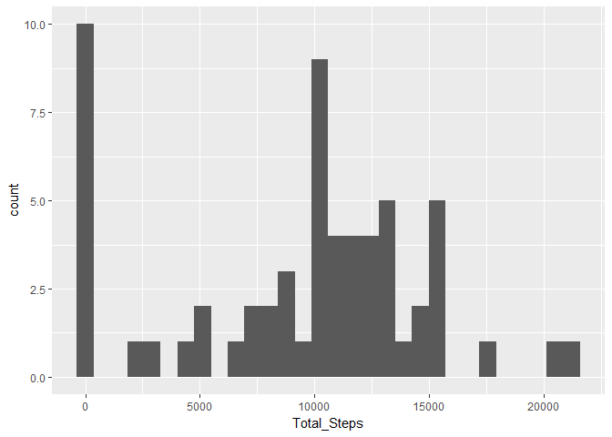
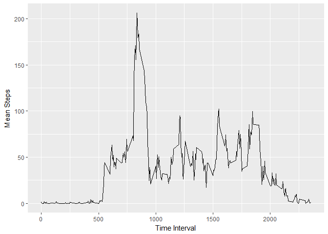
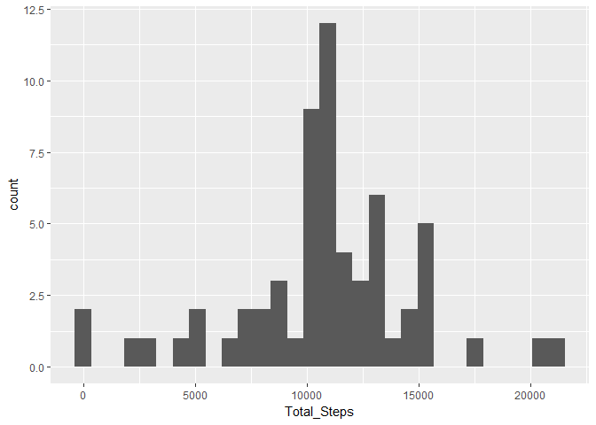
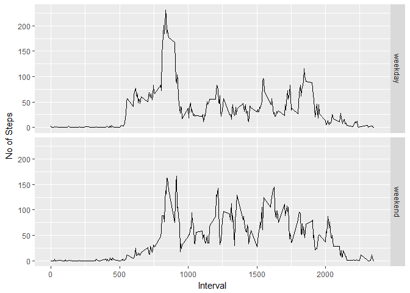

# Reproducible Research: Peer Assessment 1


## Loading and preprocessing the data
## Get the feel of the data


```r
#Let's read data first
activity_data_full=read.csv("activity.csv")

#Let's remove NAs
activity_data=activity_data_full[is.finite(activity_data_full$steps),]

#This is how our data looks
summary(activity_data)
```

```
##      steps                date          interval     
##  Min.   :  0.00   2012-10-02:  288   Min.   :   0.0  
##  1st Qu.:  0.00   2012-10-03:  288   1st Qu.: 588.8  
##  Median :  0.00   2012-10-04:  288   Median :1177.5  
##  Mean   : 37.38   2012-10-05:  288   Mean   :1177.5  
##  3rd Qu.: 12.00   2012-10-06:  288   3rd Qu.:1766.2  
##  Max.   :806.00   2012-10-07:  288   Max.   :2355.0  
##                   (Other)   :13536
```

```r
head(activity_data)
```

```
##     steps       date interval
## 289     0 2012-10-02        0
## 290     0 2012-10-02        5
## 291     0 2012-10-02       10
## 292     0 2012-10-02       15
## 293     0 2012-10-02       20
## 294     0 2012-10-02       25
```

## What is mean total number of steps taken per day?

```r
#Find out the average daily steps
d=sapply(split(activity_data,activity_data$date),function(chunk) sum(chunk$steps,na.rm = T))

#Let's decorate the data a bit
d=data.frame(d)
names(d)=c("Total_Steps")

#And this is how consolidated data looks like
summary(d)
```

```
##   Total_Steps   
##  Min.   :    0  
##  1st Qu.: 6778  
##  Median :10395  
##  Mean   : 9354  
##  3rd Qu.:12811  
##  Max.   :21194
```

```r
head(d)
```

```
##            Total_Steps
## 2012-10-01           0
## 2012-10-02         126
## 2012-10-03       11352
## 2012-10-04       12116
## 2012-10-05       13294
## 2012-10-06       15420
```
This is how our daily steps data looks like

```r
library(ggplot2)
```

```
## Warning: package 'ggplot2' was built under R version 3.3.3
```

```r
qplot(Total_Steps,data=d,geom="histogram",group="")
```

```
## `stat_bin()` using `bins = 30`. Pick better value with `binwidth`.
```

<!-- -->

Now let's find out the average and median daily steps taken

```r
mean_d=data.frame(sapply(split(activity_data,activity_data$date),function(chunk) mean(chunk$steps,na.rm = T)))
median_d=data.frame(sapply(split(activity_data,activity_data$date),function(chunk) median(chunk$steps,na.rm = T)))
names(mean_d)=c("Mean Steps")
names(median_d)=c("Median Steps")

summary(mean_d)
```

```
##    Mean Steps     
##  Min.   : 0.1424  
##  1st Qu.:30.6979  
##  Median :37.3785  
##  Mean   :37.3826  
##  3rd Qu.:46.1597  
##  Max.   :73.5903  
##  NA's   :8
```

```r
head(mean_d)
```

```
##            Mean Steps
## 2012-10-01        NaN
## 2012-10-02    0.43750
## 2012-10-03   39.41667
## 2012-10-04   42.06944
## 2012-10-05   46.15972
## 2012-10-06   53.54167
```

```r
summary(median_d)
```

```
##   Median Steps
##  Min.   :0    
##  1st Qu.:0    
##  Median :0    
##  Mean   :0    
##  3rd Qu.:0    
##  Max.   :0    
##  NA's   :8
```

```r
head(median_d)
```

```
##            Median Steps
## 2012-10-01           NA
## 2012-10-02            0
## 2012-10-03            0
## 2012-10-04            0
## 2012-10-05            0
## 2012-10-06            0
```

What's average and median of total steps taken daily?

```r
mean_before=mean(d$"Total_Steps")
print("Mean total steps")
```

```
## [1] "Mean total steps"
```

```r
print(mean_before)
```

```
## [1] 9354.23
```

```r
median_before=median(d$"Total_Steps")
print("Median total steps")
```

```
## [1] "Median total steps"
```

```r
print(median_before)
```

```
## [1] 10395
```

## What is the average daily activity pattern?

```r
mean_d=data.frame(sapply(split(activity_data,activity_data$interval),function(chunk) mean(chunk$steps,na.rm = T)))
names(mean_d)=c("Mean_Steps")
summary(mean_d)
```

```
##    Mean_Steps     
##  Min.   :  0.000  
##  1st Qu.:  2.486  
##  Median : 34.113  
##  Mean   : 37.383  
##  3rd Qu.: 52.835  
##  Max.   :206.170
```

```r
head(mean_d)
```

```
##    Mean_Steps
## 0   1.7169811
## 5   0.3396226
## 10  0.1320755
## 15  0.1509434
## 20  0.0754717
## 25  2.0943396
```

Now let's plot

```r
ggplot(data=mean_d,aes(x=as.numeric(rownames(mean_d)),y=Mean_Steps,group=1))+geom_line() + labs(x="Time Interval", y="Mean Steps")
```

<!-- -->

Which interval has the max steps on average?

```r
max_interval=as.numeric(rownames(mean_d)[which.max(mean_d$Mean_Steps)])
print("Interval with max average steps")
```

```
## [1] "Interval with max average steps"
```

```r
print(max_interval)
```

```
## [1] 835
```

## Imputing missing values

```r
#Let's check how many rows have missing data
print("Number of rows with NA's")
```

```
## [1] "Number of rows with NA's"
```

```r
print(sum(!complete.cases(activity_data_full)))
```

```
## [1] 2304
```

### Fill in the missing data with corresponding 5 min interval average

```r
#Need to find mean steps with data without NAs
interval_means=as.numeric(mean_d$Mean_Steps)

#Now let's start from the start and fill in the missing data
activity_data_full[is.na(activity_data_full$steps),"steps"]=interval_means[as.factor(activity_data_full[is.na(activity_data_full$steps),"interval"])]

#Let's verify all the missing data is filled in
print("Number of rows with NA's")
```

```
## [1] "Number of rows with NA's"
```

```r
print(sum(!complete.cases(activity_data_full)))
```

```
## [1] 0
```

```r
#How does the filled in data look like
summary(activity_data_full)
```

```
##      steps                date          interval     
##  Min.   :  0.00   2012-10-01:  288   Min.   :   0.0  
##  1st Qu.:  0.00   2012-10-02:  288   1st Qu.: 588.8  
##  Median :  0.00   2012-10-03:  288   Median :1177.5  
##  Mean   : 37.38   2012-10-04:  288   Mean   :1177.5  
##  3rd Qu.: 27.00   2012-10-05:  288   3rd Qu.:1766.2  
##  Max.   :806.00   2012-10-06:  288   Max.   :2355.0  
##                   (Other)   :15840
```

```r
activity_data=activity_data_full
```
Now let's check the daily total steps again

```r
d=sapply(split(activity_data,activity_data$date),function(chunk) sum(chunk$steps,na.rm = T))
d=data.frame(d)
names(d)=c("Total_Steps")
summary(d)
```

```
##   Total_Steps   
##  Min.   :   41  
##  1st Qu.: 9819  
##  Median :10766  
##  Mean   :10766  
##  3rd Qu.:12811  
##  Max.   :21194
```

```r
head(d)
```

```
##            Total_Steps
## 2012-10-01    10766.19
## 2012-10-02      126.00
## 2012-10-03    11352.00
## 2012-10-04    12116.00
## 2012-10-05    13294.00
## 2012-10-06    15420.00
```

```r
#Plot the daily steps
qplot(Total_Steps,data=d,geom="histogram",group="")
```

```
## `stat_bin()` using `bins = 30`. Pick better value with `binwidth`.
```

<!-- -->

```r
mean_d=data.frame(sapply(split(activity_data,activity_data$date),function(chunk) mean(chunk$steps,na.rm = T)))
median_d=data.frame(sapply(split(activity_data,activity_data$date),function(chunk) median(chunk$steps,na.rm = T)))
names(mean_d)=c("Mean Steps")
names(median_d)=c("Median Steps")

summary(mean_d)
```

```
##    Mean Steps     
##  Min.   : 0.1424  
##  1st Qu.:34.0938  
##  Median :37.3826  
##  Mean   :37.3826  
##  3rd Qu.:44.4826  
##  Max.   :73.5903
```

```r
head(mean_d)
```

```
##            Mean Steps
## 2012-10-01   37.38260
## 2012-10-02    0.43750
## 2012-10-03   39.41667
## 2012-10-04   42.06944
## 2012-10-05   46.15972
## 2012-10-06   53.54167
```

```r
summary(median_d)
```

```
##   Median Steps   
##  Min.   : 0.000  
##  1st Qu.: 0.000  
##  Median : 0.000  
##  Mean   : 4.474  
##  3rd Qu.: 0.000  
##  Max.   :34.113
```

```r
head(median_d)
```

```
##            Median Steps
## 2012-10-01     34.11321
## 2012-10-02      0.00000
## 2012-10-03      0.00000
## 2012-10-04      0.00000
## 2012-10-05      0.00000
## 2012-10-06      0.00000
```


What's average and median of total steps taken daily?

```r
mean_after=mean(d$"Total_Steps")
print("Mean total steps")
```

```
## [1] "Mean total steps"
```

```r
print(mean_after)
```

```
## [1] 10766.19
```

```r
median_after=median(d$"Total_Steps")
print("Median total steps")
```

```
## [1] "Median total steps"
```

```r
print(median_after)
```

```
## [1] 10766.19
```

Let's compare before and after imputing the data

```r
print("Mean total steps before = ")
```

```
## [1] "Mean total steps before = "
```

```r
print(mean_before)
```

```
## [1] 9354.23
```

```r
print("Mean total steps after=")
```

```
## [1] "Mean total steps after="
```

```r
print(mean_after)
```

```
## [1] 10766.19
```

```r
print("Median total steps before=")
```

```
## [1] "Median total steps before="
```

```r
print(median_before)
```

```
## [1] 10395
```

```r
print("Median total steps after=")
```

```
## [1] "Median total steps after="
```

```r
print(median_after)
```

```
## [1] 10766.19
```

## Are there differences in activity patterns between weekdays and weekends?

```r
#Let's find out which days are weekdays and which are weekends
library(lubridate)
```

```
## Warning: package 'lubridate' was built under R version 3.3.3
```

```
## 
## Attaching package: 'lubridate'
```

```
## The following object is masked from 'package:base':
## 
##     date
```

```r
dates=ymd(activity_data$date)
wd=wday(dates)
weekendcheck=wd

#Assuming sun and sat are weekends
weekendcheck[!(wd==1 | wd==7)]=0
weekendcheck[weekendcheck!=0]=1
activity_data=cbind(activity_data,factor(x=weekendcheck,labels=c("weekday","weekend")))

#Let's group based on weekend or not and check how the data looks like
library(plyr)
```

```
## Warning: package 'plyr' was built under R version 3.3.3
```

```
## 
## Attaching package: 'plyr'
```

```
## The following object is masked from 'package:lubridate':
## 
##     here
```

```r
groupcols=c("interval","weekendcheck")
datacols=c("steps")
mean_d=ddply(activity_data,groupcols, function(x) colMeans(x[datacols]))
mean_d$weekendcheck=factor(x=mean_d$weekendcheck,labels=c("weekday","weekend"))
summary(mean_d)
```

```
##     interval       weekendcheck     steps        
##  Min.   :   0.0   weekday:288   Min.   :  0.000  
##  1st Qu.: 588.8   weekend:288   1st Qu.:  2.047  
##  Median :1177.5                 Median : 28.133  
##  Mean   :1177.5                 Mean   : 38.988  
##  3rd Qu.:1766.2                 3rd Qu.: 61.263  
##  Max.   :2355.0                 Max.   :230.378
```

```r
head(mean_d)
```

```
##   interval weekendcheck      steps
## 1        0      weekday 2.25115304
## 2        0      weekend 0.21462264
## 3        5      weekday 0.44528302
## 4        5      weekend 0.04245283
## 5       10      weekday 0.17316562
## 6       10      weekend 0.01650943
```
Let's plot the data grouped by weekend or not

```r
ggplot(data=mean_d,aes(x=as.numeric(interval),y=steps,group=1))+geom_line()+facet_grid(weekendcheck~.) + labs(x="Interval",y="No of Steps")
```

<!-- -->

That's it, r markdown rocks...!!!
